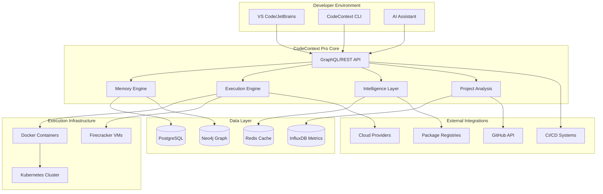
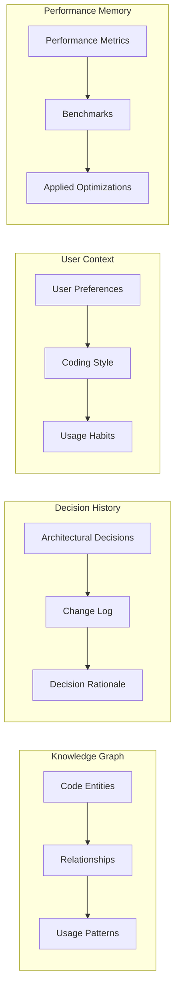
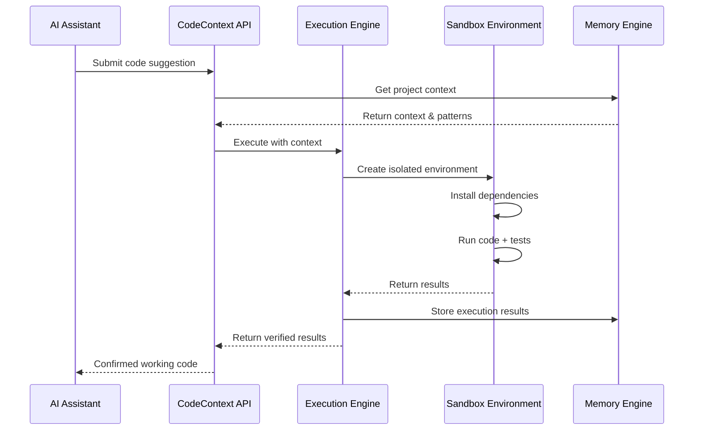
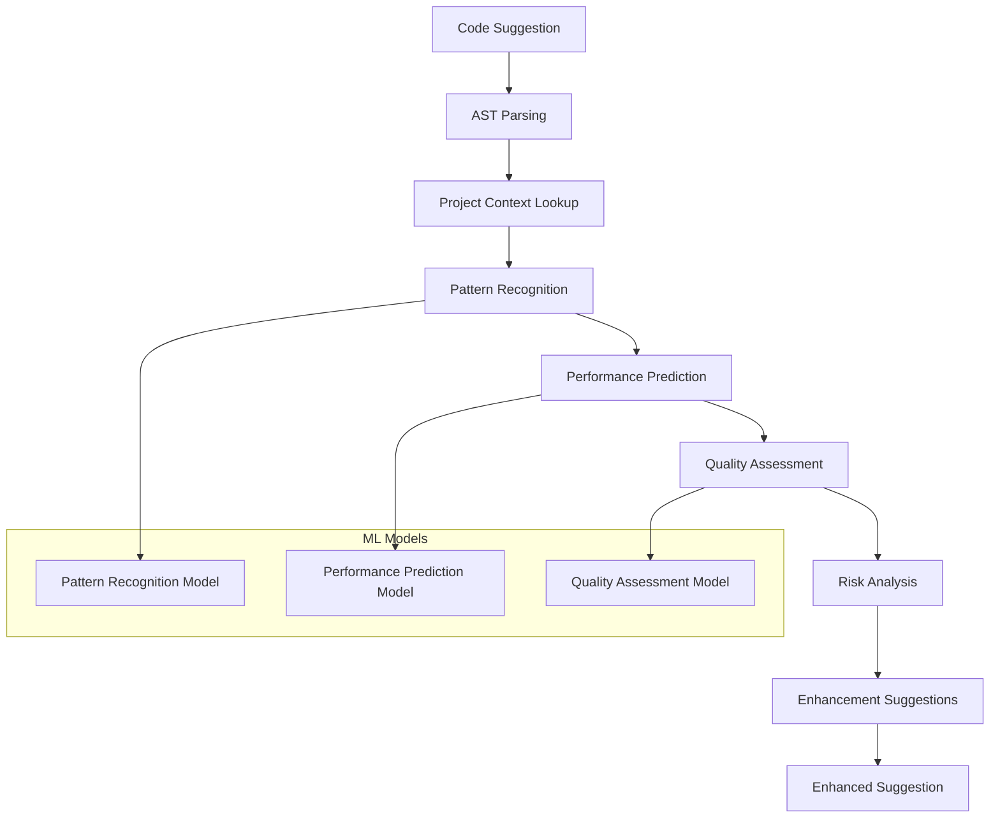
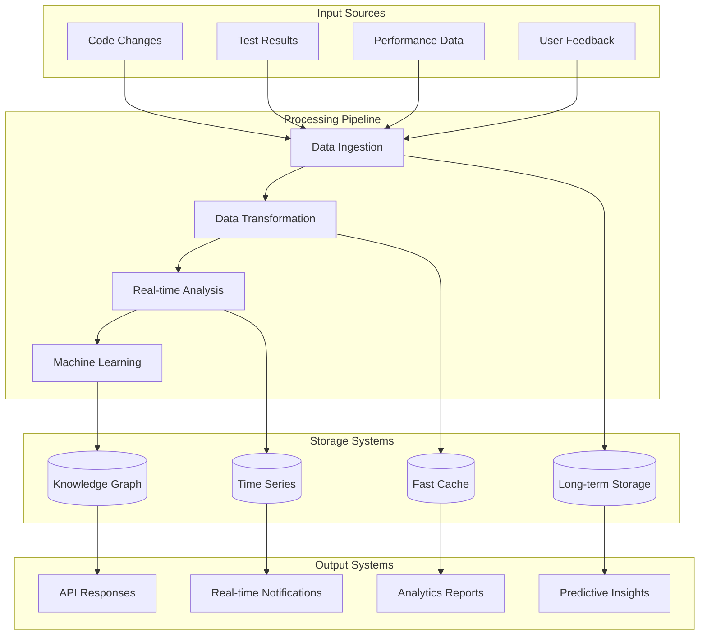
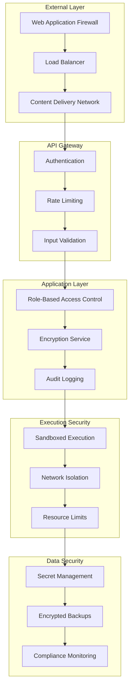
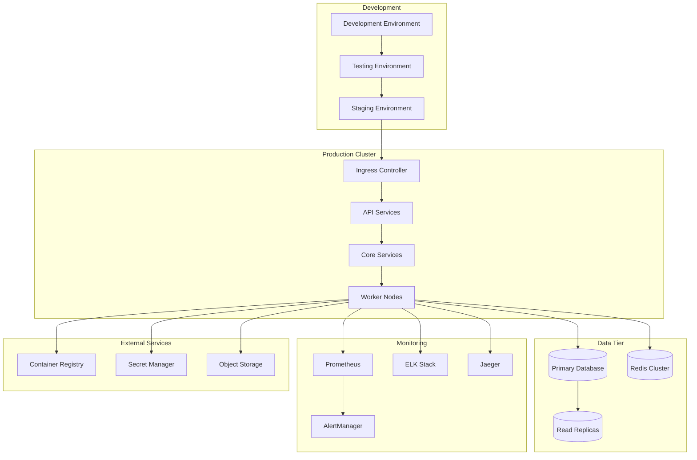

# 🏗️ CodeContext Pro - System Architecture Diagrams

## High-Level System Architecture

## Memory Engine Architecture

## Execution Engine Flow

## Intelligence Layer Processing

## Data Flow Architecture

## Security Architecture

## Deployment Architecture

These diagrams illustrate the comprehensive architecture needed to build a tool that would truly amplify AI coding assistant capabilities by solving the fundamental tooling limitations they currently face.
